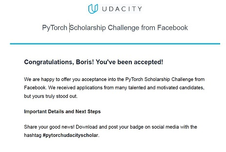
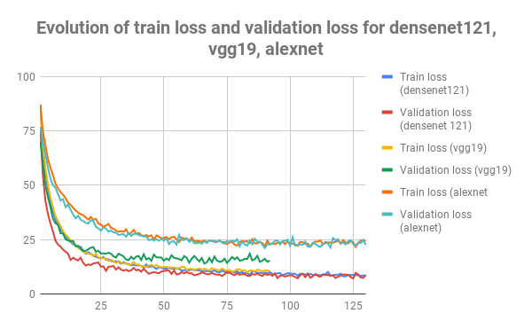
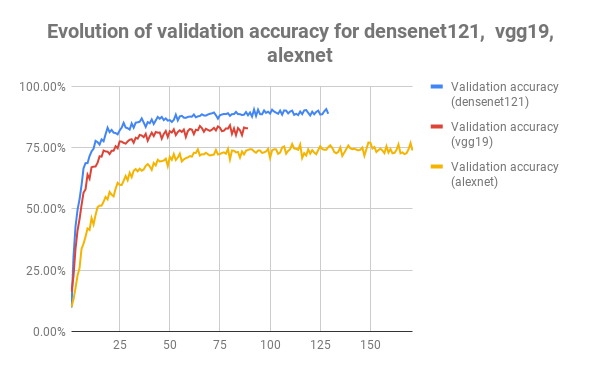

## flower_classifier

This project was developed for PyTorch Scholarship Challange 2018/2019. I was succesfully accepted to this progran: 

### Introduction

This image classifier can distinguish different species of flowers from 102 categories[this dataset](http://www.robots.ox.ac.uk/~vgg/data/flowers/102/index.html). It uses trained Convolutional Neural Networks provided in PyTorch, which is a freely available Deep Learning module kindly offered by Facebook and architecture of the classifier was .

### Code 

Code was developed in the provided template in Jupyter Notebook. It is well commented and can be found in this repo. Due to the huge number of parameters in the developed model and intensive matrix/tensor computations it is recommended to use gpu. The Colab was used for this purpose and it ran for 5-8 hours to get results even on gpu. 

#### Models 
3 Different were used:
* densenet121
* vgg19
* alexnet

and compared between each other below. 

### Version control 

I have tried to manage the version control based on [this article](https://towardsdatascience.com/version-control-with-jupyter-notebooks-f096f4d7035a). However, because I'd run the code on Colab it became complecated to control versions, but it was still managed.  

## Summary

To avoid overfitting at every epoch we compare the minimum validation loss with the current and if the current validation loss is less than the minimum the checkpoint was saved as the better classifier model compare to the previous one. 

The evolution of train loss and validation loss can be seen below on the graph: 

It is easy to see that the train and validation losses are lower for densenet121 than for vgg19 and alexnet. 
The last saved best checkpoints for each model are:

* densenet121 - epoch 125 with validation accuracy 90.152%
* vgg19 - epoch 65 with validation accuracy 83.864%
* alexnet - epoch 89 with validation accuracy 74.091% 

As we can see, the best validation accuracy was reached for densenet121 - 90.152%. The evolution of validation accuracy for 3 models is shown below: 

Again, the densenet121 shows a better performance. 

It is interesting to note that during testing the testing accuracy for each model usually are 2-3% higher higher compare to validation accuracy. It can be explan as we validation dataset we extracted 20% pictures from the training dataset which was randomly rotated, croped and resized.   

Thank you Udacity and Facebook for such opportunity! 

